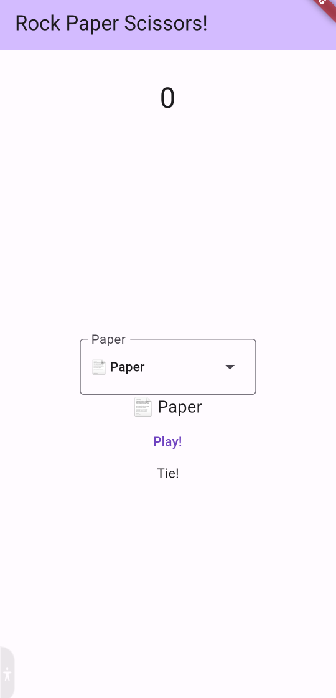

# Rock Paper Scissors

Rock Paper Scissors!

## Descrizione

Come suggerisce il nome, l'applicazione simula una partita di carta forbice sasso contro il computer

  

### Strumenti usati

* [Flutter]("https://flutter.dev/"), Il framework dart usato per creare l'app
  * [Confetti]("https://pub.dev/packages/confetti"), la liberia usata per i coriandoli
* [Android Studio]("https://developer.android.com/studio"), l'IDE usato

